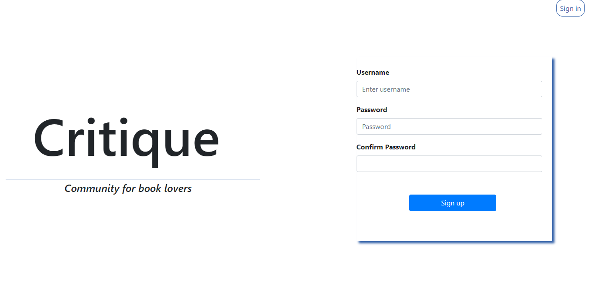
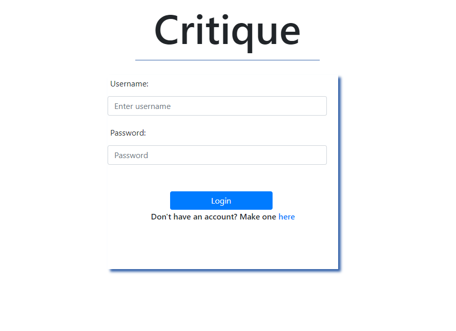
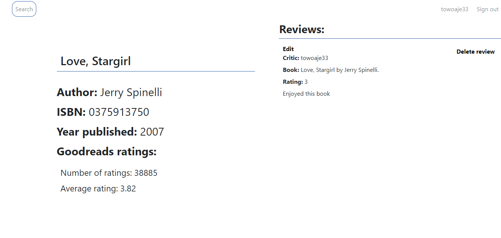
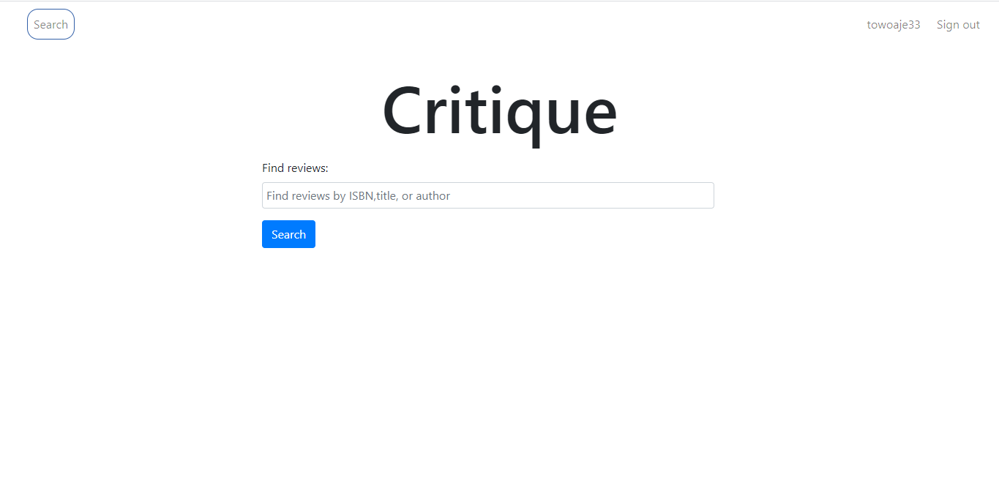
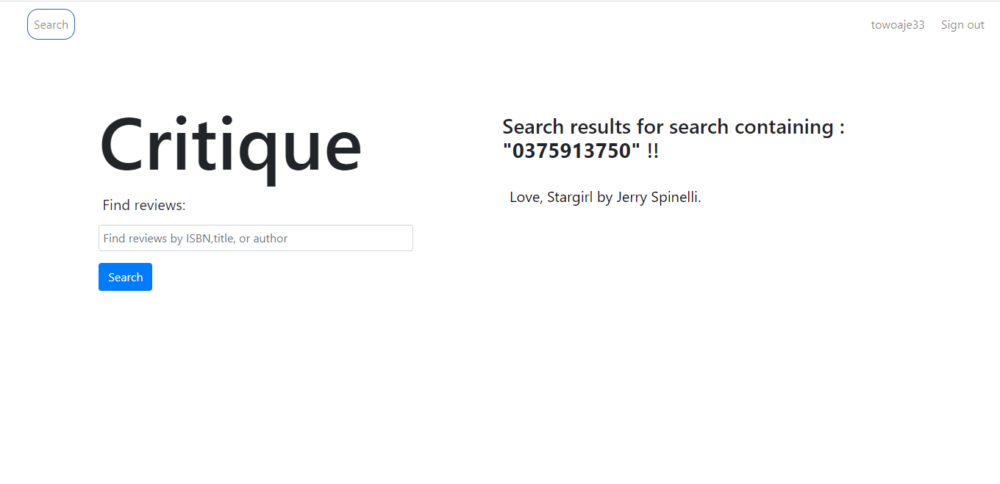
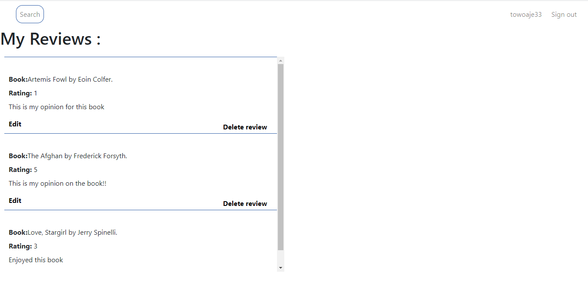

# CritiqueWebApp
Recently read a good book, or is it a book you are not really fond off? 
Leave a review in Critique and discuss with your fellow book lovers.

## About The Project
I created this web app as a side project to develop my skills in web development 
with python. I learned how to process user input, login and authentication, sessions, 
retrieving data from an external API and database management.

## Technologies Used

* [Flask](https://flask.palletsprojects.com/en/1.1.x/)
* [Bootstrap](https://getbootstrap.com/)
* [Postgres](https://www.postgresql.org/)
* [Heroku](https://www.heroku.com/)

External API:
* [Goodreads](https://www.goodreads.com/)

## App Screenshots
 

 
	
 
    
 
    
 
    
 
    
 
    
 

    
    
    
    

    
